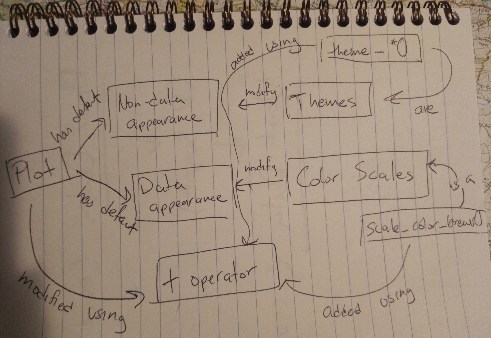

# Welcome to r4greg

Welcome to the workshop! This lesson will build on the basic **ggplot2** vocabulary you learned in [part 1 of the workshop](http://github.com/paleolimbot/r4ags) to help make your plots look the way you want them to. [Click here](https://rstudio.cloud/project/342897) to launch an RStudio IDE pre-loaded with today's exercise.

### Learner persona for this exercise

Lauren works for a provincial geological survey and has a M.Sc. in Geology. She has much experience in Excel, and learned statistics with Minitab in her undergraduate degree. Lauren would like to use R to do more sophisticated analysis with the provincial survey data, and has heard that learning R will be helpful to further her career. While she tends learn things quickly, she often has difficulty asking for help.

### Concept map

Resources for future learning:

- [R for Data Science](http://r4ds.had.co.nz) by Hadley Wickham and Garrett Grolemund
- [Install R](https://cloud.r-project.org/) ([Windows](https://cloud.r-project.org/bin/windows/) or [Mac](https://cloud.r-project.org/bin/macosx/))
- [Install RStudio](https://www.rstudio.com/products/rstudio/#Desktop)

Many slides in this workshop are derivative work of [Master the Tidyverse](https://github.com/rstudio-education/master-the-tidyverse) by Garrett Grolemund of [RStudio](https://rstudio.com), and are licensed under a Creative Commons-BY license. The `warwick` dataset is a modified version of the [Warwick Mountain Lithgeochemistry](https://novascotia.ca/natr/meb/download/dp505dds.asp) dataset from the Nova Scotia Department of Energy and Mines, and is distributed as package data from the [geoscidata](https://github.com/paleolimbot/geoscidata) package.
